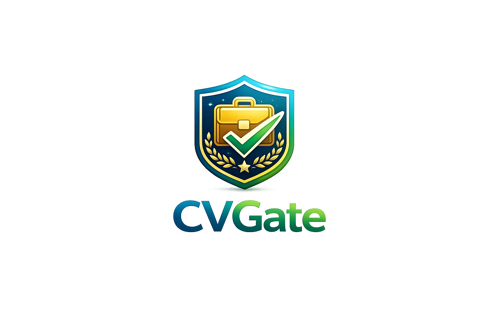
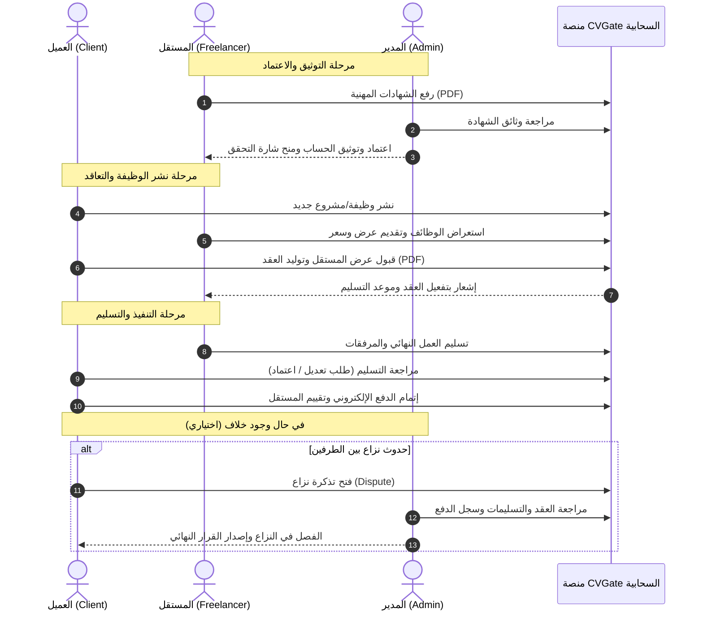

# CVGate | بوابة السيرة الذاتية والتوظيف الحر 🚀

<div align="center">



### **مشروع تخرج - جامعة الحدود الشمالية (Northern Border University)**
**كلية علوم الحاسب وتقنية المعلومات**

[](https://flutter.dev)
[](https://dart.dev)
[](https://firebase.google.com)
[](https://firebase.google.com/docs/firestore)
[](https://bloclibrary.dev)
[](https://flutter.dev)

<p align="center">
  <b>منصة ذكية متكاملة لإدارة التوظيف الحر وتوثيق العقود والشهادات المهنية تربط بين العملاء والمستقلين تحت إشراف إداري محكم.</b>
</p>

</div>

---

## 📑 فهرس المحتويات

- [1. مقدمة ونبذة تعريفية](#1-مقدمة-ونبذة-تعريفية)
  - [نبذة عن المشروع](#نبذة-عن-المشروع)
  - [المشكلة التي يحلها المشروع](#المشكلة-التي-يحلها-المشروع)
  - [أهداف المشروع](#أهداف-المشروع)
- [2. فريق العمل (Team Members)](#2-فريق-العمل-team-members)
- [3. الميزات الرئيسية (Features)](#3-الميزات-الرئيسية-features)
  - [بوابة العميل (Client Portal)](#أولاً-بوابة-العميل-client-portal)
  - [بوابة المستقل (Freelancer Portal)](#ثانياً-بوابة-المستقل-freelancer-portal)
  - [لوحة تحكم المدير (Admin Dashboard)](#ثالثاً-لوحة-تحكم-المدير-admin-dashboard)
  - [الميزات المشتركة والأمان](#رابعاً-الميزات-المشتركة-والأمان)
- [4. التقنيات المستخدمة (Tech Stack)](#4-التقنيات-المستخدمة-tech-stack)
- [5. هيكلة المشروع (Project Structure)](#5-هيكلة-المشروع-project-structure)
- [6. دورة عمل النظام (System Workflow)](#6-دورة-عمل-النظام-system-workflow)
- [7. بنية البيانات وقاعدة البيانات (Database Schema)](#7-بنية-البيانات-وقاعدة-البيانات-database-schema)
- [8. طريقة التثبيت والتشغيل (Getting Started)](#8-طريقة-التثبيت-والتشغيل-getting-started)
  - [التشغيل عبر سطر الأوامر (Terminal)](#1-التشغيل-عبر-سطر-الأوامر-terminal)
  - [التشغيل على بيئة ماك (macOS)](#2-التشغيل-على-بيئة-ماك-macos)
  - [التشغيل عبر Android Studio](#3-التشغيل-عبر-android-studio)
- [9. حماية البيانات وملف .gitignore](#9-حماية-البيانات-وملف-gitignore)
- [10. شكر وتقدير](#10-شكر-وتقدير)

---

## 1. مقدمة ونبذة تعريفية

### نبذة عن المشروع
**CVGate (بوابة السيرة الذاتية)** هو تطبيق للهواتف الذكية وسطح المكتب تم تطويره كمشروع تخرج متميز في **جامعة الحدود الشمالية (Northern Border University)** بالمملكة العربية السعودية.

يمثل التطبيق منصة عمل حر رقمية شاملة وبيئة تعاقد ذكية صُممت لردم الفجوة بين **أصحاب العمل والشركات (العملاء - Clients)** وبين **المستقلين وأصحاب الكفاءات المهنية (Freelancers)**، مع وجود **إدارة مركزية (Admin)** تضمن جودة المخرجات، ومصداقية الشهادات، والعدالة التعاقدية والمالية لكلا الطرفين.

---

### المشكلة التي يحلها المشروع
تعاني منصات العمل الحر التقليدية وأسواق الخدمات المصغرة من ثغرات جوهرية تحد من فعاليتها وأمانها، ومن أبرزها:

1. **غياب آليات التحقق من المؤهلات والشهادات:** صعوبة تأكد أصحاب الأعمال من حقيقة مهارات المستقلين ومصداقية شهاداتهم الأكاديمية والمهنية، مما يرفع من مخاطر استلام أعمال غير مطابقة للمواصفات.
2. **ضياع الحقوق وغياب العقود القانونية الموثقة:** اعتماد كثير من صفقات العمل الحر على محادثات غير رسمية، مما يسبب نزاعات متكررة حول الشروط، الميزانية، أو مواعيد التسليم.
3. **تشتت قنوات التسليم والمراجعة:** عدم وجود آلية قياسية تسمح بمراجعة الأعمال المسلّمة، وطلب التعديلات، واعتماد التسليم النهائي قبل صرف المستحقات.
4. **ضعف آليات التحكيم والرقابة الإدارية:** افتقار العديد من الأنظمة لجهة محايدة تملك سجلات موثقة تُمكّنها من الفصل العادل في النزاعات المالية والتقنية بين العميل والمستقل.

---

### أهداف المشروع
- **بناء سوق عمل حر سعودي موثوق:** الإسهام في تحقيق مستهدفات **رؤية المملكة 2030** وبرامج التحول الرقمي عبر تمكين الكفاءات الوطنية الشابة وتيسير وصولها لفرص العمل.
- **التوثيق والاعتماد الإداري الصارم:** فحص واعتماد الشهادات الأكاديمية والمهنية المرفوعة بصيغة PDF من قِبل إدارة المنصة قبل منح شارة التوثيق.
- **أتمتة دورة التعاقد الذكي:** توليد وثائق عقود رسمية متكاملة بصيغة PDF تتضمن كافة البنود والالتزامات والمواعيد، وقابلة للمعاينة والتحميل داخل التطبيق.
- **الحماية والشفافية المالية:** توفير نظام تتبع دقيق للمدفوعات وحساب المستحقات، وربطها بمراحل التسليم والتقييم المتبادل.
- **إدارة عادلة للنزاعات (Dispute Resolution):** توفير لوحة تحكم ذكية للإدارة تتيح مراجعة سجلات المشاريع والتسليمات للبت الموضوعي في أي نزاع.

---

## 2. فريق العمل (Team Members)

تم تصميم وتطوير هذا المشروع بكل فخر بواسطة طالبات قسم تقنية المعلومات وعلوم الحاسب في **جامعة الحدود الشمالية (Northern Border University)**:

<div align="center">

| # | اسم العضوة | الجامعة |
|---|---|---|
| 1 | **مشاعل جمال الرويشد** | جامعة الحدود الشمالية |
| 2 | **شيخه محمد العنزي** | جامعة الحدود الشمالية |
| 3 | **ملاك مناور الروسان** | جامعة الحدود الشمالية |
| 4 | **تغريد حمد الرشيدي** | جامعة الحدود الشمالية |
| 5 | **شموخ عبدالله الشمري** | جامعة الحدود الشمالية |
| 6 | **وفاء خالد التومي** | جامعة الحدود الشمالية |
| 7 | **رغد مانع الشمري** | جامعة الحدود الشمالية |
| 8 | **عاليه فرحان الشمري** | جامعة الحدود الشمالية |
| 9 | **رغد محمد المريغي** | جامعة الحدود الشمالية |
| 10 | **ريماس سعد سويدان** | جامعة الحدود الشمالية |
| 11 | **مريم شلواح الشمري** | جامعة الحدود الشمالية |
| 12 | **عائشة حسين الشمري** | جامعة الحدود الشمالية |
| 13 | **ريما عويضه الحربي** | جامعة الحدود الشمالية |

</div>

---

## 3. الميزات الرئيسية (Features)

يقدم تطبيق **CVGate** تجربة متكاملة ومصممة خصيصاً لكل فئة من المستخدمين عبر 3 أدوار رئيسية:

```
                  ┌────────────────────────┐
                  │    CVGate Platform     │
                  └───────────┬────────────┘
         ┌────────────────────┼────────────────────┐
         ▼                    ▼                    ▼
┌─────────────────┐  ┌─────────────────┐  ┌─────────────────┐
│  بوابة العميل   │  │  بوابة المستقل  │  │  لوحة الإدارة   │
│ (Client Portal) │  │(Freelancer Hub) │  │ (Admin Panel)   │
└─────────────────┘  └─────────────────┘  └─────────────────┘
```

### أولاً: بوابة العميل (Client Portal)
- **لوحة المعلومات (Dashboard):** عرض إحصائيات فورية لعدد الوظائف المنشورة، العقود السارية، إجمالي المدفوعات، والإشعارات الواردة.
- **نشر وإدارة الوظائف:** 
  - إمكانية نشر مشاريع ووظائف جديدة مع تحديد المسمى، الوصف، الميزانية، المهارات المطلوبة، والمدة الزمنية.
  - متابعة حالة الوظائف (مفتوحة، قيد التنفيذ، منتهية) وتعديلها أو إغلاقها.
- **استعراض وتعيين المستقلين:**
  - مراجعة طلبات التقديم (Applications) والعروض المالية والرسائل التعريفية من المستقلين.
  - تصفح قائمة المستقلين والبحث المتقدم وتصفيتهم حسب التخصص والتقييم والمهارات.
  - فحص الملف الشخصي للمستقل وشهاداته المعتمدة من الإدارة وسجله السابق.
- **توليد وإدارة العقود الإلكترونية:**
  - توليد عقود رسمية ملزمة بصيغة PDF بنقرة زر واحدة.
  - معاينة وثيقة العقد داخل التطبيق عبر مشغل PDF تفاعلي.
  - متابعة مراحل سريان العقد وتواريخ الاستحقاق.
- **مراجعة التسليمات والتقييم:**
  - مراجعة الأعمال والملفات المسلّمة من المستقل، واعتمادها أو طلب تعديلها.
  - تقييم المستقل وكتابة مراجعة نصية وتقييم بالنجوم ينعكس على ملفه المهني.
- **إدارة المدفوعات والفواتير:**
  - سداد مستحقات المشاريع، وعرض الفواتير الإلكترونية المفصلة وسجل الحركات المالية.

---

### ثانياً: بوابة المستقل (Freelancer Portal)
- **الملف المهني ومعرض الأعمال (Profile & Portfolio):**
  - بناء سيرة ذاتية إلكترونية متكاملة تضم النبذة المهنية، المهارات، ومعلومات التواصل.
  - رفع الشهادات الأكاديمية والمهنية والدورات التدريبية بصيغة PDF للتدقيق والاعتماد.
  - عرض شارة التوثيق الرسمية بجانب الشهادات المعتمدة من قِبل إدارة النظام.
- **استكشاف الوظائف والتقديم الذكي:**
  - تصفح المشاريع المفتوحة والمتاحة والبحث عنها حسب التخصص والمهارة.
  - تقديم عروض مخصصة تشمل السعر المقترح ومدة التنفيذ وخطاب العرض (Cover Letter).
  - متابعة مسار الطلبات (قيد المراجعة، مقبولة، مرفوضة) لحظة بلحظة.
- **إدارة الأعمال والعقود النشطة:**
  - الاطلاع على شروط وتفاصيل العقود المبرمة مع العملاء.
  - تسليم المشروع المنجز وإرفاق الملفات النهائية، الروابط، والملاحظات التوضيحية للعميل.
- **المالية والتقييمات:**
  - متابعة الرصيد المالي المكتسب والدفعات المحولة وحالات الفواتير.
  - استعراض تقييمات العملاء والآراء لتحسين التنافسية في المنصة.
- **التنبيهات الفورية:**
  - استلام إشعارات فورية عند قبول العروض، توقيع العقود، استلام الدفعات، واعتماد الشهادات.

---

### ثالثاً: لوحة تحكم المدير (Admin Dashboard)
- **مركز القيادة والإحصائيات:**
  - مؤشرات أداء لحظية (Real-time KPIs) تشمل إجمالي أعداد المستخدمين، الوظائف، العقود النشطة، حجم الأموال المتداولة، والنزاعات.
- **إدارة المستخدمين والحسابات:**
  - الاطلاع على حسابات العملاء والمستقلين والتحقق من هوياتهم.
  - إمكانية تفعيل أو تجميد أو تعليق الحسابات غير الملتزمة بالشروط والسياسات.
- **نظام تدقيق واعتماد الشهادات (Certificates Verification):**
  - فحص ملفات الشهادات المرفوعة بصيغة PDF من المستقلين عبر عارض PDF مدمج.
  - اعتماد الشهادة لتظهر موثقة للمستخدمين، أو رفضها مع كتابة سبب معلل يصل للمستقل.
- **الرقابة على الوظائف والعقود:**
  - مراقبة كافة الوظائف المنشورة للتأكد من موافقتها للأنظمة العامة وقوانين العمل.
  - الإشراف على العقود المبرمة وحالات تنفيذها.
- **إدارة المدفوعات وفض النزاعات (Dispute Resolution):**
  - سجل مالي موحد للعمليات والمقبوضات والمصروفات.
  - غرفة فض النزاعات: استعراض الشكاوى، تفاصيل العقد، التسليمات المقدمة، والمحادثات للبت فيها بالعدل وصرف المستحقات لمستحقيها.
- **التقارير والإعدادات:**
  - استخراج تقارير إحصائية دورية وضبط إعدادات المنصة ونماذج العقود والشروط والأحكام.

---

### رابعاً: الميزات المشتركة والأمان
- **المصادقة الآمنة (Authentication):** نظام تسجيل دخول وتسجيل حساب حديث ومحمي مع تشفير كلمات المرور والتحقق عبر Firebase Auth.
- **الواجهات والتجربة (UI/UX):** تصميم حديث يدعم اللغة العربية بالكامل ومستوحى من هوية بصرية عربية أنيقة مع خطوط عربية أصيلة (بهيج جنة، تجوال).
- **إدارة الحالة الاحترافية:** اعتماد نمط BLoC / Cubit لضمان سرعة الاستجابة واستقرار التطبيق وفصل طبقة الواجهات عن منطق الأعمال (Business Logic).
- **التخزين المحلي السريع:** حفظ مؤشرات الجلسة وبيانات المستخدم النشط محلياً عبر `SharedPreferences` للوصول الفوري.

---

## 4. التقنيات المستخدمة (Tech Stack)

تم اختيار حزمة تقنيات عصرية وموثوقة لضمان أداء سلس وتوافقية واسعة:

| المجال | التقنية | الإصدار / التفاصيل | الاستخدام في المشروع |
|---|---|---|---|
| **إطار العمل الرئيسي** | **Flutter** | `^3.5.2` | بناء تطبيق متعدد المنصات بكود برمجي موحد |
| **لغة البرمجة** | **Dart** | `>=3.5.2` | اللغة الأساسية لكتابة منطق التطبيق والواجهات |
| **إدارة الحالة** | **flutter_bloc / bloc** | `^8.1.6` | تطبيق نمط Cubit للفصل التام بين الـ UI والـ State |
| **المصادقة والأمان** | **Firebase Auth** | `^5.5.3` | إدارة تسجيل الدخول وإنشاء الحسابات والأدوار |
| **قاعدة البيانات السحابية** | **Cloud Firestore** | `^5.6.7` | قاعدة بيانات NoSQL سريعة تدعم المزامنة الفورية (Real-time) |
| **تخزين الملفات السحابي** | **Firebase Storage** | `^12.4.5` | استضافة ملفات الشهادات والوثائق والوسائط بصيغة PDF والصور |
| **التخزين المحلي** | **shared_preferences** | `^2.5.3` | تخزين إعدادات المستخدم وبيانات الجلسة محلياً |
| **توليد ملفات PDF** | **pdf** | `^3.11.3` | توليد عقود العمل بصيغة PDF وتنسيق بنودها آلياً |
| **معاينة المستندات** | **syncfusion_flutter_pdfviewer** | `^26.2.14` | استعراض وقراءة وثائق العقود والشهادات داخل التطبيق |
| **انتقاء الملفات والصور** | **file_picker / image_picker** | `^8.1.7 / ^1.1.2` | تمكين المستخدم من رفع الوثائق والصور من ذاكرة الجهاز |
| **التنقل والواجهات** | **google_nav_bar** | `^5.0.7` | شريط تنقل سفلي عصري وسلس |
| **الروابط الخارجية** | **url_launcher** | `^6.3.1` | فتح الروابط والمواقع الخارجية والبريد الإلكتروني |
| **الخطوط العربية** | **Custom Fonts** | Bahij Janna, Tajawal | تجربة قراءة عربية فاخرة ومتناسقة |

---

## 5. هيكلة المشروع (Project Structure)

تم تنظيم المشروع باتباع أفضل الممارسات الهندسية لفصل المسؤوليات:

```text
cv_Gate/
├── .gitignore                          # ملف استبعاد الملفات الحساسة والمجلدات المؤقتة
├── README.md                           # التوثيق الشامل والرسمي للمشروع
├── README_SETUP.md                     # دليل إعداد وتشغيل المنصات (Mac & Android)
│
└── cv_Gate/                            # المجلد الأساسي لتطبيق Flutter
    ├── pubspec.yaml                    # ملف الاعتماديات والحزم والخطوط
    ├── analysis_options.yaml           # قواعد فحص جودة ونقاء الكود (Linter)
    │
    ├── assets/                         # الموارد والملفات الثابتة
    │   ├── fonts/                      # الخطوط العربية والإنجليزية (Janna, Tajawal..)
    │   └── images/                     # الصور وأيقونات وشعار التطبيق (appLogo.png)
    │
    ├── android/                        # إعدادات ونظام بناء الأندرويد (Gradle, Manifest)
    ├── ios/                            # إعدادات نظام أبل iOS (Podfile, Info.plist)
    ├── macos/                          # إعدادات تطبيق سطح المكتب للماك (Entitlements)
    │
    └── lib/                            # كود المصدر الأساسي (Dart Source Code)
        ├── main.dart                   # نقطة انطلاق التطبيق وتهيئة Firebase
        ├── firebase_options.dart       # إعدادات الاتصال الموحدة بـ Firebase للمنصات
        │
        ├── core/                       # الأساسيات والثيم العام
        │   └── styles/
        │       └── colors.dart         # لوحة ألوان التطبيق الرئيسية
        │
        ├── bloc/                       # طبقة إدارة الحالة (Business Logic Component)
        │   ├── admin bloc/             # Cubit وحالات إدارة المدير (AdminCubit)
        │   ├── client/                 # Cubit وحالات إدارة العميل (ClientCubit)
        │   └── freelancer bloc/        # Cubit وحالات إدارة المستقل (FreelancerCubit)
        │
        ├── shared/                     # المكونات والخدمات المشتركة
        │   ├── components.dart         # الأزرار والحقول والعناصر القابلة لإعادة الاستخدام
        │   ├── tokens.dart             # الثوابت ومعرفات المستخدمين
        │   ├── app_colors.dart         # الألوان التنسيقية المشتركة
        │   └── services/
        │       └── local/
        │           └── Cash_Helper.dart# إدارة التخزين المحلي (SharedPreferences)
        │
        └── screens/                    # واجهات المستخدم (UI Screens)
            ├── splash/                 # شاشة البداية والتحقق من الجلسة
            │   └── Splash_Screen.dart
            │
            ├── auth/                   # واجهات المصادقة
            │   ├── login_screen.dart   # شاشة تسجيل الدخول
            │   └── create_account_screen.dart # شاشة إنشاء الحساب وتحديد الدور
            │
            ├── client/                 # واجهات العميل (18 شاشة)
            │   ├── dashboard/          # لوحة تحكم العميل
            │   ├── jobs/               # نشر وتعديل وتفاصيل الوظائف وطلبات التقديم
            │   ├── freelancers/        # تصفح المستقلين وفحص ملفاتهم المهنية
            │   ├── contracts/          # توليد ومعاينة عقود الـ PDF ومراجعة التسليمات
            │   ├── payments/           # سداد المستحقات وسجل الفواتير
            │   ├── profile/            # تعديل وعرض الملف الشخصي
            │   └── notifications/      # إشعارات العميل
            │
            ├── freelancer/             # واجهات المستقل (17 شاشة)
            │   ├── dashbord/           # لوحة تحكم المستقل والإحصائيات
            │   ├── jobs/               # استعراض الوظائف المتاحة ومتابعة الطلبات
            │   ├── Profile/            # السيرة الذاتية ورفع الشهادات للتحقق ومعرض الأعمال
            │   ├── Works/              # تفاصيل العقود وتسليم المشاريع المكتملة
            │   ├── payments/           # تفاصيل الأرباح والمستحقات والعمليات المالية
            │   ├── reviews/            # استعراض تقييمات العملاء
            │   └── notifications/      # إشعارات المستقل
            │
            └── Admin/                  # واجهات لوحة تحكم المدير (18 شاشة)
                ├── Dashboard/          # لوحة المؤشرات والإحصائيات العامة
                ├── Manage Users/       # إدارة الحسابات وتدقيق واعتماد الشهادات
                ├── Manage Jobs and Contract/ # الرقابة على الوظائف والعقود المبرمة
                ├── Manage Payments and Disputed/ # التحكيم في النزاعات ومتابعة المدفوعات
                ├── Reports/            # التقارير الإحصائية
                └── Settings/           # إعدادات النظام والشروط ونماذج العقود
```

---

## 6. دورة عمل النظام (System Workflow)



---

## 7. بنية البيانات وقاعدة البيانات (Database Schema)

يعتمد التطبيق على بنية **Cloud Firestore (NoSQL)** المرنة وعالية الكفاءة، مقسمة إلى المجموعات (Collections) التالية:

| اسم المجموعة (Collection) | الوصف والمحتوى | الحقول الأساسية |
|---|---|---|
| `users` | سجلات الحسابات والبيانات الأساسية والأدوار | `uid`, `email`, `name`, `role` (client/freelancer/admin), `phone`, `createdAt`, `isActive` |
| `users/{uid}/profile` | الملف المهني التفصيلي للمستقل | `bio`, `skills`, `title`, `hourlyRate`, `rating`, `completedProjects` |
| `users/{uid}/certificates` | الشهادات الأكاديمية والمهنية المرفوعة | `certId`, `title`, `issuer`, `issueDate`, `pdfUrl`, `status` (pending/approved/rejected), `adminNotes` |
| `jobs` | الوظائف والمشاريع المنشورة | `jobId`, `clientId`, `title`, `description`, `budget`, `skills`, `deadline`, `status` (open/in_progress/closed) |
| `applications` | طلبات التقديم على المشاريع | `appId`, `jobId`, `freelancerId`, `bidAmount`, `coverLetter`, `status` (pending/accepted/rejected) |
| `contracts` | عقود العمل الإلكترونية الموثقة | `contractId`, `jobId`, `clientId`, `freelancerId`, `amount`, `terms`, `pdfUrl`, `status` (active/completed/disputed) |
| `submissions` | الأعمال والملفات المسلّمة | `subId`, `contractId`, `freelancerId`, `description`, `fileUrls`, `submissionDate`, `status` (submitted/revision/accepted) |
| `payments` | الحركات والمعاملات المالية | `paymentId`, `contractId`, `clientId`, `freelancerId`, `amount`, `date`, `status`, `paymentMethod` |
| `reviews` | التقييمات والآراء بعد اكتمال العقد | `reviewId`, `contractId`, `reviewerId`, `revieweeId`, `rating` (1-5), `comment`, `createdAt` |
| `disputes` | قضايا وتذاكر النزاعات المرفوعة للإدارة | `disputeId`, `contractId`, `openedBy`, `reason`, `evidenceUrls`, `status` (open/under_review/resolved), `adminVerdict` |
| `notifications` | التنبيهات والإشعارات الفورية للمستخدمين | `notifId`, `recipientId`, `title`, `body`, `type`, `read`, `timestamp` |

---

## 8. طريقة التثبيت والتشغيل (Getting Started)

### المتطلبات الأساسية المشتركة (Prerequisites)
قبل البدء، تأكد من تثبيت الأدوات التالية على جهازك:
1. **Flutter SDK:** الإصدار `3.5.2` أو أحدث. (يمكن التحقق بالأمر: `flutter --version`).
2. **Dart SDK:** الإصدار `3.5.2` أو أحدث (مضمن تلقائياً مع Flutter).
3. **Git:** لإدارة النسخ واستنساخ المشروع.
4. **حساب ومشروع Firebase مهيأ** لتفعيل خدمات Authentication, Firestore, و Storage.

---

### 1. التشغيل عبر سطر الأوامر (Terminal)

#### الخطوة 1: استنساخ المستودع (Clone Repository)
```bash
git clone https://github.com/ShaykhahM/cv_Gate.git
cd cv_Gate/cv_Gate
```

#### الخطوة 2: تثبيت الحزم والاعتماديات (Install Dependencies)
```bash
flutter pub get
```

#### الخطوة 3: إعداد ملفات البيئة والإعدادات الحساسة
- يحتوي ملف `lib/firebase_options.dart` على إعدادات الاتصال بـ Firebase للمشروع الحالي.
- في حال الرغبة بربط مشروع Firebase خاص بك، قم بتشغيل أداة FlutterFire CLI:
  ```bash
  dart pub global activate flutterfire_cli
  flutterfire configure
  ```
- تأكد من وضع ملف `google-services.json` داخل المجلد:
  ```text
  android/app/google-services.json
  ```
- وإذا كنت تستخدم ملف متغيرات بيئة `.env` لأي مفاتيح إضافية، أنشئ ملفاً باسم `.env` في جذر مجلد التطبيق (راجع `.gitignore` للتأكد من حمايته).

#### الخطوة 4: فحص جاهزية النظام
```bash
flutter doctor
```
تأكد من عدم وجود أي علامات خطأ حمراء حرجة.

#### الخطوة 5: عرض الأجهزة المتاحة وبدء التشغيل
```bash
# عرض قائمة الأجهزة والمحاكيات المتصلة
flutter devices

# بدء تشغيل التطبيق على الجهاز المتصل الافتراضي
flutter run

# أو تحديد الجهاز مباشرة:
flutter run -d chrome    # للويب
flutter run -d macos     # لتطبيق الماك المكتبي
flutter run -d android   # لمحمّل أو هاتف الأندرويد
```

---

### 2. التشغيل على بيئة ماك (macOS)

يدعم مشروع **CVGate** التشغيل المباشر كتطبيق مكتبي أصلي على أجهزة **macOS Desktop**، بالإضافة إلى تشغيله على محاكي **iOS Simulator**.

#### المتطلبات الخاصة بنظام macOS:
- جهاز كمبيوتر يعمل بنظام macOS (معالج Apple Silicon M-series أو Intel).
- تثبيت حزمة **Xcode** عبر Mac App Store مع أدوات سطر الأوامر:
  ```bash
  xcode-select --install
  ```
- تثبيت مدير الحزم **CocoaPods**:
  ```bash
  sudo gem install cocoapods
  # أو عبر Homebrew:
  brew install cocoapods
  ```

#### خطوات التهيئة والتشغيل على الماك:
1. **الانتقال إلى مجلد المشروع وتثبيت حزم الـ Pods:**
   ```bash
   cd cv_Gate/macos
   pod install
   cd ..
   ```
2. **صلاحيات التطبيق (App Entitlements):**
   تم تجهيز ملفات الصلاحيات (`DebugProfile.entitlements` و `Release.entitlements`) بالصلاحيات اللازمة:
   - صلاحية الاتصال بالشبكة والإنترنت: `com.apple.security.network.client`
   - صلاحية قراءة ورفع الملفات والشهادات: `com.apple.security.files.user-selected.read-write`
3. **ملف تهيئة أبل لـ Firebase:**
   تم تضمين ملف `GoogleService-Info.plist` في كل من:
   - `macos/Runner/GoogleService-Info.plist`
   - `ios/Runner/GoogleService-Info.plist`
4. **أمر التشغيل المباشر على الماك:**
   ```bash
   flutter run -d macos
   ```
5. **للتشغيل على محاكي الآيفون (iOS Simulator):**
   ```bash
   open -a Simulator
   flutter run -d ios
   ```

---

### 3. التشغيل عبر Android Studio

يعد **Android Studio** البيئة المثالية لتطوير واختبار التطبيق على بيئة Android:

#### الخطوة 1: استيراد المشروع (Import / Open Project)
1. افتح برنامج **Android Studio**.
2. من الشاشة الرئيسية، اختر **Open** (أو من القائمة العلوية: **File -> Open...**).
3. تصفح المجلدات واختر مجلد المشروع المباشر:
   ```text
   /path/to/cv_Gate/cv_Gate
   ```
   > 💡 **ملاحظة هامة:** احرص على فتح المجلد الذي يحتوي على ملف `pubspec.yaml` مباشرة ليتم التعرف على المشروع كمشروع Flutter قياسي.

#### الخطوة 2: مزامنة وضبط إعدادات الـ SDK
1. افتح إعدادات البرنامج:
   - على نظام **macOS**: `Android Studio -> Settings (أو Preferences)`.
   - على نظام **Windows**: `File -> Settings`.
2. انتقل إلى: **Languages & Frameworks -> Flutter**.
   - تأكد من تحديد مسار مجلد تثبيت **Flutter SDK Path** في جهازك.
3. انتقل إلى: **Languages & Frameworks -> Dart**.
   - فعّل خيار `Enable Dart support for the project cv_gate`، وحدد مسار Dart SDK (غالباً يكون تلقائياً داخل مجلد Flutter).
4. اضغط على **Apply** ثم **OK**.
5. سيظهر شريط في أعلى ملف `pubspec.yaml`، اضغط على زر **Pub get** لتحميل وتحديث كافة الحزم البرمجية، أو افتح الـ Terminal الداخلي واكتب:
   ```bash
   flutter pub get
   ```

#### الخطوة 3: إعداد محاكي الأندرويد (Android Emulator) أو جهاز حقيقي
- **باستخدام المحاكي (Virtual Device - AVD):**
  1. افتح أداة **Device Manager** من الشريط الجانبي الأيمن.
  2. اضغط على **Create Virtual Device**.
  3. اختر جهازاً حديثاً (مثل Pixel 7 أو Pixel 8)، واختر نظام تشغيل Android حديث (API 34 أو API 33).
  4. اضغط على زر التشغيل ▶️ لبدء تشغيل المحاكي.
- **باستخدام هاتف أندرويد حقيقي (Physical Device):**
  1. ادخل إلى إعدادات الهاتف -> خيارات المطور (Developer Options).
  2. فعّل خيار **تصحيح أخطاء USB (USB Debugging)**.
  3. وصّل الهاتف بالكمبيوتر عبر كابل USB واقبل رسالة التصريح التي ستظهر على شاشة الهاتف.

#### الخطوة 4: تشغيل التطبيق (Run & Debug)
1. في الشريط العلوي لـ Android Studio، تأكد من اختيار ملف الإقلاع: `main.dart`.
2. من القائمة المنسدلة للأجهزة، اختر جهازك المتصل أو المحاكي المشغل.
3. اضغط على زر التشغيل الأخضر ▶️ **Run** (أو زر التصحيح 🪲 **Debug**).
4. ستبدأ عملية بناء حزم Gradle وسيتم تثبيت التطبيق وفتحه تلقائياً على شاشة جهازك.

---

## 9. حماية البيانات وملف .gitignore

لحماية البيانات الحساسة والحفاظ على كفاءة المستودع وخفته، تم إعداد ملف `.gitignore` احترافي وشامل يمنع رفع أي ملفات سرية أو مؤقتة، ويشمل:

- **ملفات البيئة والمتغيرات الحساسة:** `.env`, `.env.*`, `*.env`, `*.local`.
- **حزم ومجلدات Node الضخمة:** `node_modules/` وكافة سجلات أخطاء npm/yarn.
- **ملفات بناء ومؤقتات Flutter و Dart:** مجلد `build/`, `.dart_tool/`, `.pub-cache/`, `.flutter-plugins-dependencies`.
- **مخلفات ومؤقتات بناء Android و Gradle:** `android/.gradle/`, `local.properties`, `key.properties`, ومجلدات بناء الـ APK المؤقتة (`debug/`, `release/`).
- **مخلفات بيئات أبل (iOS / macOS):** مجلدات `Pods/`, `ephemeral/`, وملفات التوليد المؤقتة.
- **ملفات نظام التشغيل والـ IDE:** `.DS_Store`, مجلدات `.idea/`, `.vscode/`, وملفات `*.iml`.

---

## 10. شكر وتقدير

يتقدم فريق العمل بوافر الشكر والتقدير إلى:
- **جامعة الحدود الشمالية (Northern Border University):** على الدعم الأكاديمي والبيئة المحفزة التي أسهمت في إنجاح هذا العمل.
- **أعضاء هيئة التدريس والمشرفين الأفاضل:** على توجيهاتهم القيمة وإشرافهم المستمر طيلة مراحل التخطيط والتنفيذ لمشروع التخرج.

<div align="center">

**CVGate © 2026 - جميع الحقوق محفوظة**  
*مشروع تخرج من جامعة الحدود الشمالية*

</div>
